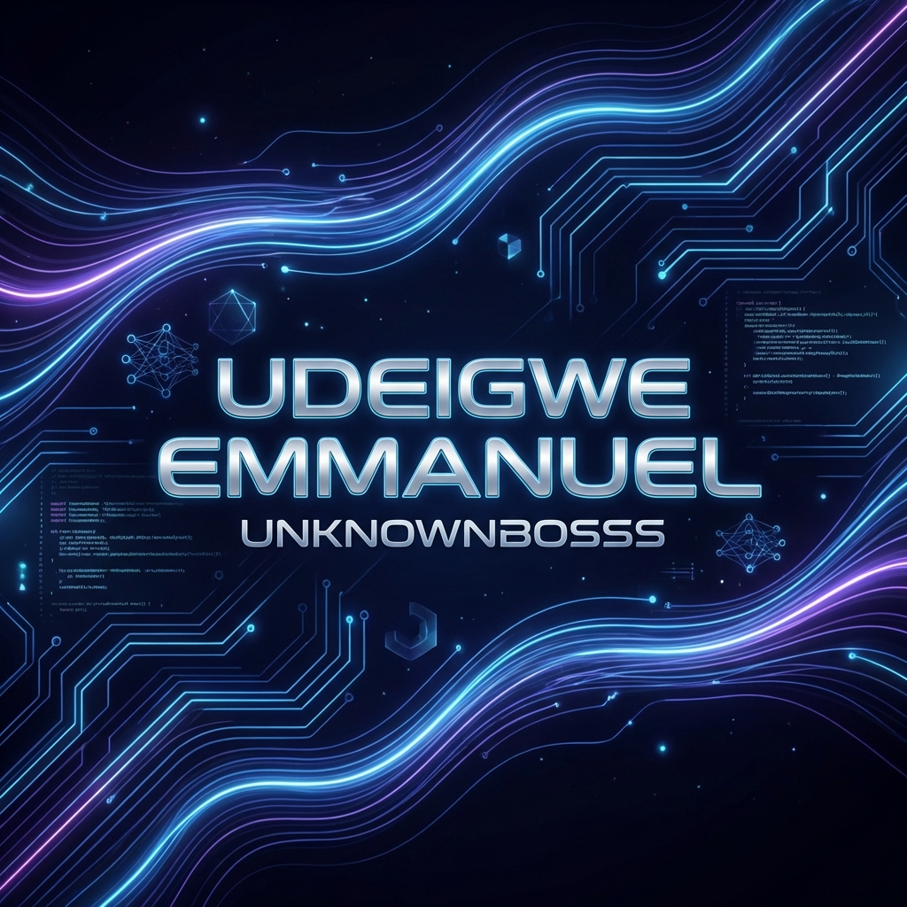

# 👋 Hi, I'm Udeigwe Emmanuel (Unknownbosss)

  

  

---

### 🚀 About Me

I am a **Computer Science Graduate** with a deep passion for building scalable applications and exploring the frontiers of **Artificial Intelligence**. I love turning complex problems into elegant, user-centric solutions.

- 🎓 Computer Science Graduate.
- 🔭 Currently working exclusively on **[FlipTheSwitch](https://fliptheswitch.netlify.app/)**.
- 🌱 Learning more about AI integrations and advanced system design.
- 💬 Ask me about **React, Node.js, or AI**.

---

### 🛠️ Tech Stack

  <!-- Frontend -->
  
  
  
  
  
   
  <!-- Backend -->
  
  
  
  
  

---

### 📊 GitHub Stats

 
  
   
  

---

### 📫 Connect with Me

  

---

  <i>"Code is like humor. When you have to explain it, it’s bad."</i>

